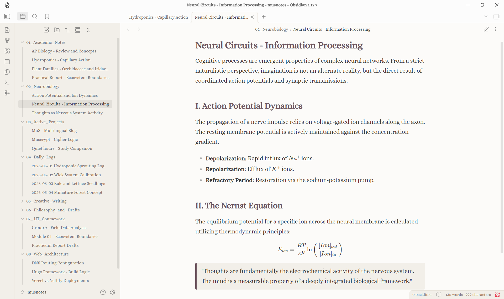
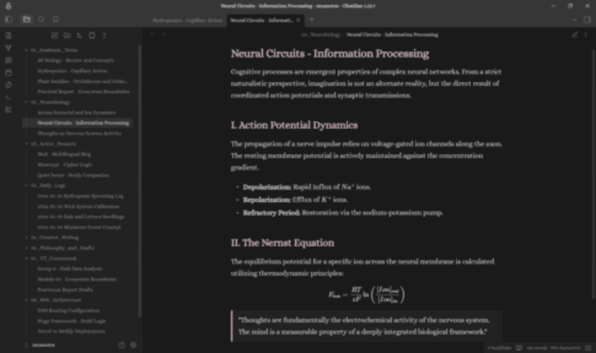

# 🌿 musnotes theme for Obsidian

A botanical-cosmic aesthetic theme for Obsidian, designed to feel like a digital garden and a seamless extension of the [MuS blog](https://musnotes.my.id) universe. 

## ✨ Vibe & Concept
This theme brings a warm, cozy, and poetic environment to your digital second brain. Whether you are drafting essays, exploring systems thinking, or writing code, the UI is designed to reduce eye strain and inspire deep focus. 

The color palette shifts gracefully between environments:
*   **☀️ Light Mode:** A warm cream base with dark text and deep mauve/muted orchid accents, reminiscent of a classic botanical field journal.
*   **🌙 Dark Mode:** A deep, immersive dark background with dusty pink typography, feeling like a quiet, starry night in an orbital lab.

## 🪐 Key Features
*   **Custom Typography:** Beautifully integrated with the elegant **Alice** serif font for a poetic, literary feel.
*   **Poetic Signature Footer:** Features a custom orbital signature icon and "© 2026 MuS·" copyright delicately placed at the bottom of every note, giving your workspace a published, studio-like finish.
*   **Eye-Friendly Contrast:** Carefully balanced contrast to prevent fatigue during long writing or study sessions.
*   **Seamless Reading Flow:** Polished blockquotes, elegant graph view nodes, and refined markdown rendering.

## 📸 Screenshots

### ☀️ Light Mode - *The Botanical Field Journal*

### 🌙 Dark Mode - *The Orbital Lab*

## 🛠️ Installation

**Method 1: Community Store (Recommended)**
*(Currently pending official Obsidian Community approval! Check back soon!)*
1. Open your Obsidian vault.
2. Go to **Settings** > **Appearance** > **Manage** (under Themes).
3. Search for **musnotes** and click **Install** and **Use**.

**Method 2: Manual Installation**
If you want to try the theme before it's officially listed:
1. Download the `theme.css` and `manifest.json` files from this repository.
2. Open your Obsidian vault.
3. Go to **Settings** > **Appearance**.
4. Under the Themes section, click the **Folder icon** to open your `.obsidian/themes` folder.
5. Create a new folder named `musnotes` and paste the two downloaded files inside it.
6. Go back to Obsidian, hit **Refresh** on the themes list, and select **musnotes** to apply!

---
*Created by [MuS](https://musnotes.my.id).*